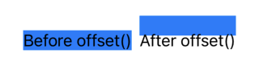

# Entry 2
##### 12/07/23

I finished following a [tutorial](https://www.swift.org/getting-started/swiftui/) I found on Swift's official [documentation](https://www.swift.org/documentation/). From the tutorial, I learned about a SwiftUI view `Spacer()`, the `withAnimation()` function, and the two modifiers `id()` and `transition()`. `Spacer()` just adds space equally between two views. The `withAnimation()` function creates a smooth transition between each activity in the. It can be customized with `.easeInOut(duration: 1)` which is the amount of time it'll take for each activity to slide. Lastly, when the tutorial said to add `.transition(.slide)` and `.id(id)` to the inner `VStack`, I was confused because I didn't it didn't show me where. So, I put them in different places such as after the icon, after the header, and inside the button (which gave me an error), but none of them worked the same way as the tutorial. I kept rereading the tutorial to see if I could figure out what it meant by "add these two modifiers to the inner `VStack` until I accidentally pasted the modifiers in the right place.

```swift
var body: some View {
    VStack {
        Spacer()
        Text("Why not try...")
            .font(.largeTitle.bold())

            // Does not belong here because the header is not supposed to move
            // .transition(.slide)
            // .id(id)


        VStack {
            Circle()
                .fill(colors.randomElement() ?? .green)
                .padding(50)
                .overlay(
                    Image(systemName: "figure.\(selected.lowercased())")
                        .font(.system(size: 144))
                        .foregroundColor(.white)
                )
            Text("\(selected)!")
                .font(.title)
        }
        // Here is where it belongs
        .transition(.slide)
        .id(id)

        Spacer()

        Button("Try Again") {
            withAnimation (.easeInOut(duration: 1)) {
                selected = activities.randomElement() ?? "Archery"
                id += 1

                // causes an error
                // .transition(.slide)
                // .id(id)

            }
        }
        // Doesn't belong here unless you want the button to slide too
        // .transition(.slide)
        // .id(id)


        .buttonStyle(.borderedProminent)

    }


}
```

After finishing with the tutorial above, the documentation recommended a [website](https://developer.apple.com/tutorials/swiftui) which has many tutorials on SwiftUI. I followed the first [tutorial](https://developer.apple.com/tutorials/swiftui/creating-and-combining-views) about an app to build Landmarks. This tutorial aims to practice creating and combining views. I was excited to know that there was an easy way to write code when it mentioned an inspector tool. To use the inspector, I have to change the mode to selectable and then Command-Control-click to the view you want to inspect. You get to change the text, size, padding, color, transition, and other things I'm unfamiliar with. Moreover, `Spacer()` also works horizontally, it expands until the containing view uses all the space in its parent view.

Another challenge I encountered was adding an image because the tutorial didn't specify how to do it. I had to look through the tutorial's screenshots tabs. I saw that the image was open in a tab called `Assets`, so I was exploring with my tabs until I found `Assets`. I downloaded a cat image and uploaded it by clicking on the plus sign at the bottom. After I got uploaded my image, I didn't know why my image wasn't showing so I tried dragging the image to the `ContentView`, but it didn't work. I thought it was probably the image's name. I checked the tutorial's image name and what they put in `Image(_:)` initializer, and both were named the same thing, `turtlerock`. My image was called `Image` so I had to replace `turtlerock` with `Image`.

The image was created in a different file so I pasted my code to the `ContentView`. Later, I realized I did not have to paste the code because I could add the image by just putting the file name and parenthesis (`CircleImage()`).

For `offset(y: -130)`, I didn't understand why the image moved to the top. I found `offset` familiar so I went back to my 10th-grade notes and I thought it was the same as `position: relative` where the value represents how are how far away you moving from, but this logic doesn't work for `offset(x:)` because the image moves exactly where the value is. The way I think of `y` is that the value and sign is the direction is how far away you're moving away from that direction. For example, with `offset(y: -130)`, I think of the image moving 130 pixels away from the bottom. The same thing could be said with ``offset(y: 130)`, where the image moves 130 pixels from the top. Meanwhile, for the `x`, the image goes in the direction that the sign indicates, and how much the image is moved is based on the value.

I tried googling what the logic was for the values of `offset`. I couldn't find the answer, but instead, I found a [website](https://www.hackingwithswift.com/quick-start/swiftui/how-to-adjust-the-position-of-a-view-using-its-offset#:~:text=Important%3A%20Using%20offset()%20will,that%20wasn't%20your%20intention.) where I learned that any modifiers before `offset` will be affected and any modifiers after modifiers after will not be affected.

```swift
HStack {
    Text("Before offset()")
        .background(.blue)
        .offset(y: 15)

    Text("After offset()")
        .offset(y: 15)
        .background(.blue)
}
```


The last thing I learned with the tutorial helped me understand the first tutorial when I was struggling to add the modifiers `.transition(.slide)` and `.id(id)` to the inner `VStack`. When you apply a modifier to a layout view, such as a stack, SwiftUI applies the modifier to all the elements within the group. This makes me realize why the name of the activity and the circle with the icon slide together when the button is clicked, and it's because the name and the icon are all inside the `VStack` as a whole group. Additionally, I like how the tutorial uses this concept to refactor the code.

from:
```swift
HStack {
    Text("Lucy the cat")
        .font(.subheadline)
    Spacer()
    Text("NYC")
        .font(.subheadline)

}
```

to:
```swift
HStack {
    Text("Lucy the cat")

    Spacer()

    Text("NYC")

}
.font(.subheadline)
.foregroundStyle(.secondary)
```

I’m currently in the research the problem stage in the engineering design process. The next stage will be to continue to research the problem because there is still more to learn about Swift.

The three skills that I’m developing are how to learn, how to read, and how to google. I had to follow two tutorials to learn about Swift. I got more familiar with Swift, but at some point in the first tutorial, I was confused about the instructions and had to find the answer on my own by moving the modifiers to different places. Eventually, I was able to clarify my confusion as I continued with the second tutorial. I also had to google how `offset` works and even though I didn't have a clear answer, I understand how it works in my way. Additionally, I learned something new about `offset` while I was googling about it's values.

### Takeaways
* Google things you do not understand, and even if you do not find the answer to your question, you will learn something new similar, or possibly something different.
* Even if you do not understand something, there is a chance you will get it after you keep going through the tutorials.

### FP goal is for winter break
* I want to follow the next [tutorial](https://developer.apple.com/tutorials/swiftui/building-lists-and-navigation) which is about building list and navigation.
* I'm still not familiar with the syntax of Swift so I want to watch this [YouTube video](https://www.youtube.com/watch?v=8Xg7E9shq0U). I will watch the sections' variables, operators, if and else, and functions.


[Previous](entry01.md) | [Next](entry03.md)

[Home](../README.md)
