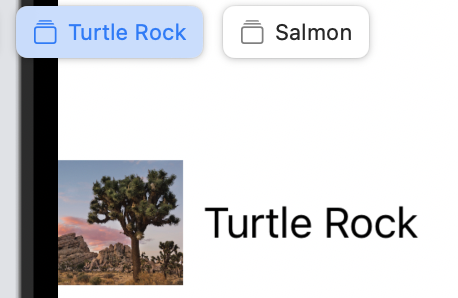
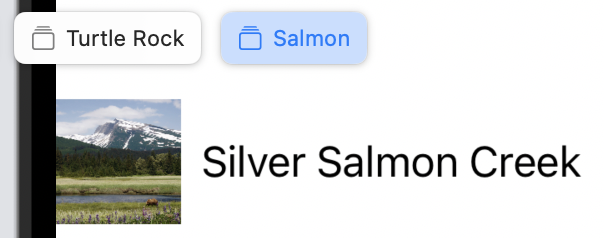
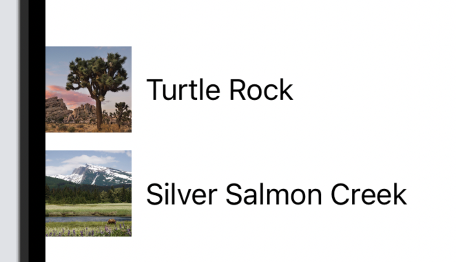
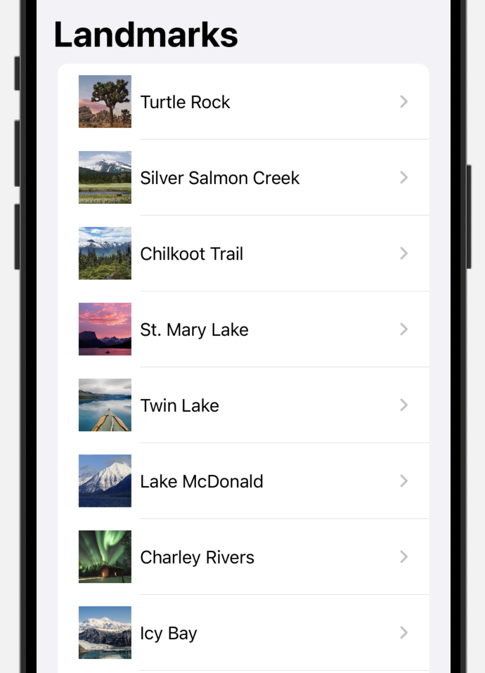
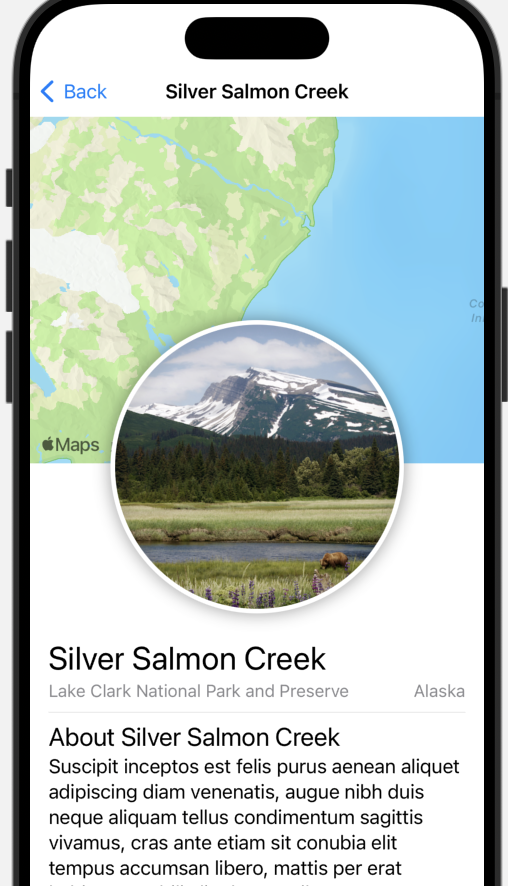

# Entry 3
##### 02/18/24

I moved on to the next tutorial about [building lists and navigation](https://developer.apple.com/tutorials/swiftui/building-lists-and-navigation). I had to continue working on the same project I was working on for the first tutorial. For the first step, I had to drag a file called `landmarkData.json` into my navigation pane. I tried looking for it in every folder, even in my laptop files, but such file did not exists. I felt like giving up and it was only the first step. However, once I scrolled up to the top of the page, I saw a symbol that said "project files". So this whole time, including the first tutorial, I did not have to make my files or add my own image, I only had to download the files. Nevertheless, I did learn how to upload an image on my own.

I was unsure what the `resizable()` modifier method does, so I googled about it. According to the [Swift documentation](https://developer.apple.com/documentation/swiftui/image/resizable(capinsets:resizingmode:)) and [Codecademy](https://www.codecademy.com/resources/docs/swiftui/viewmodifier/resizable), it is used to resize the image to fit the space in the parent container. It also comes with two optional parameters, `capInsets:` and `resizingMode:`. I commented out `resizable()` and the images become bigger. I also commented out the following line `.frame(width: 50, height: 50)` and the images became even bigger.

Something I learned about the canvas is that it can only show one preview at a time, but you can create multiple previews to see how each of them behaves with different data. With multiple previes, you have the option to name them as well.

```swift
26 #Preview("Turtle Rock") {
27    LandmarkRow(landmark: landmarks[0])
28 }
29
30 #Preview("Salmon") {
31    LandmarkRow(landmark: landmarks[1])
32 }
```




Additionally, you can group views together with a container called `Group`.

```swift
#Preview{
    Group {
        LandmarkRow(landmark: landmarks[0])
        LandmarkRow(landmark: landmarks[1])
    }
}
```


Two other useful views that will come in handy for my freedom project are `NavigationSplitView` and `NavigationLink` because they can allow the user to select a recipe and take them to the detailed page about the recipe. The `NavigationSplitView` view sets up navigation from a list to its children, while the `NavigationLink` view helps transition to a destination view. So when one of the landmarks is clicked, it takes the user to another page about the information of the landmark.

```swift
struct LandmarkList: View {
    var body: some View {
        NavigationSplitView {
            List(landmarks) { landmark in
                NavigationLink {
                    LandmarkDetail(landmark: landmark)

                } label: {
                    LandmarkRow(landmark: landmark)
                }
            }
            .navigationTitle("Landmarks")
        } detail: {
            Text("Select a Landmark")
        }
    }
}
```




I understand the flow of this project and how each file is connected to each other (similar to classes in Java), but the syntax of the new modifiers and views is confusing. However, this tutorial helped me gain a better sense of what I want my app to look like. I'm planning on doing the [Codecademy free course](https://www.codecademy.com/enrolled/courses/learn-swift) about Swift next because the lessons on Codecademy are straightforward. I'm planning on completing the next [tutorial](https://developer.apple.com/tutorials/swiftui/handling-user-input) as well, which will be helpful for the users to mark their favorite recipes.

I’m currently in the research stage of the problem-solving process in engineering design. The next step will be to continue researching Swift.

The four skills that I’m developing are a growth mindset, how to learn, how to read, and how to google. At first, I wanted to give up on the tutorial because I couldn't find the file I needed, but then I realized later that the solution was to download the project's files. There's always a solution to the problem. Additionally, I followed another tutorial to learn about Swift, and when I wasn't sure what a modifier did, I googled it.


### Takeaways
* Read the tutorial carefully because you might have to download files to make the project work
* Don't give up, there's always a solution
* Tinker with the code, and if you're still unsure, use Google.

[Previous](entry02.md) | [Next](entry04.md)

[Home](../README.md)